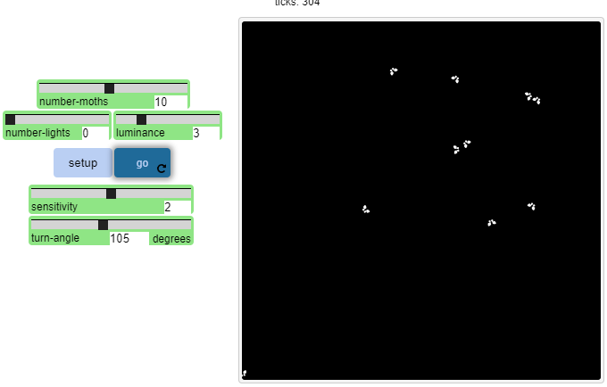
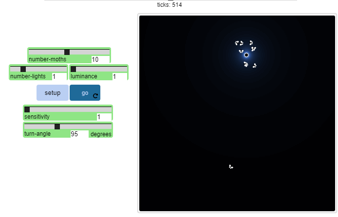
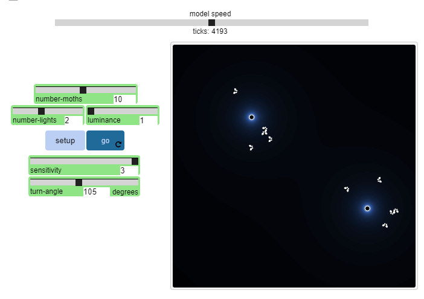

## Імітаційне моделювання комп'ютерних систем
## СПм-21-2, **Кравець Владислав Євгенович**
### Лабораторна робота №**1**. Опис імітаційних моделей та проведення обчислювальних експериментів

 

### Вибрана модель у середовищі NetLogo:
[Moths](http://www.netlogoweb.org/launch#http://www.netlogoweb.org/assets/modelslib/Sample%20Models/Biology/Moths.nlogo)

 

### Вербальний опис моделі:
Ця модель демонструє метеликів, які літають колами навколо світла. Кожна моль дотримується ряду простих правил. Жодне з правил не визначає, що метелик повинен шукати, а потім кружляти світлом. Скоріше спостережувана закономірність виникає в результаті поєднання випадкового польоту молі та простих правил поведінки, описаних нижче.

Вчені запропонували кілька пояснень того, чому молі приваблюють світло, а потім обертаються. Наприклад, колись вчені вважали, що нічні метелики пересуваються небом, орієнтуючись на Місяць, і що тяжіння метеликів до сусідніх земних джерел світла (таких як вуличний ліхтар) виникло через те, що вони помилково прийняли земне світло за Місяць. Однак, хоча це пояснення може здатися розумним, воно не підтверджується наявними науковими доказами.

### Як це працює:
Молі демонструють два основних типи поведінки. Коли вони виявляють джерело світла на відстані (до 200 футів), молі прагнуть летіти прямо до світла. Потім, коли молі наближаються до світла, вони намагаються відвернутися від світла, щоб уникнути його.

По-перше, молі відчувають світло в безпосередній близькості від них і повертаються в напрямку, де світло найбільше.
По-друге, нічні метелики порівнюють світло, що знаходиться безпосередньо перед ними, зі світлом, яке знаходиться в їхньому поточному місці. Якщо відношення «світло попереду» до «світло тут» нижче порогового значення, метелики летять вперед до світла. Якщо відношення «світло попереду» до «світло тут» вище порогового значення, метелики відвертаються від світла. Поріг визначається чутливістю метеликів до світла.
Якщо метелики не виявляють ніякого світла або просто немає світла в просторі, де вони літають, метелики пурхають безладно.

### Керуючі параметри:

NUMBER-MOTHS: цей повзунок визначає, скільки джерел світла буде створено

NUMBER-LIGHTS: цей повзунок визначає, скільки індикаторів буде створено. Зауважте, що це значення впливає лише на модель під час налаштування.

LUMINANCE: цей повзунок впливає на те, наскільки яскравим буде світло. Коли світло створюється, йому призначається яскравість 20 плюс випадкове значення від 0 до ЯРКОСТІ. Вогні з більшою яскравістю можуть відчути молі на великій відстані. Зауважте, що зміна LUMINANCE під час роботи моделі не має жодного ефекту.

SENSITIVITY: цей повзунок визначає, наскільки метелики чутливі до світла. Коли ЧУТЛИВІСТЬ вища, нічні метелики здатні виявляти дане джерело світла на більшій відстані та відвертаються від джерела світла на більшій відстані.

TURN-ANGLE: цей повзунок визначає кут, під яким метелики повертаються, коли відчувають, що співвідношення «світло попереду» до «світло тут» перевищує їхнє порогове значення.

 

## Обчислювальні експерименти

### 1. Запустіть симуляцію без освітлення. Що ви можете сказати про особливості польоту метеликів?

Метелики в пошуках неіснуючого світла.

### 2. Зупинивши симуляцію, використовуйте такі значення: - NUMBER-LIGHTS: 1 - LUMINANCE: 1 - NUMBER-MOTHS: 10 - SENSITIVITY: 1.00 - TURN-ANGLE: 95 Зверніть увагу, що спочатку одні метелики можуть літати випадково, а інші відразу притягуються до світла. чому

Деякі метелики можуть літати випадково, бо SENSITIVITY: 1, чутливість до світла низька.

### 3. Поки модель працює, збільште SENSITIVITY. Що відбувається зі схемою польоту молі? Подивіться, чи зможете ви створити умови, за яких одна або кілька нічних метеликів зможуть «втекти» зі свого стану постійного кружляння світла.

Моль віддаляється при збільшенні чутливості, метелики ніяк не хочуть "тікати".